# 🗺️ Mappa Logica - Youth Football Manager

> Diagrammi di flusso per comprendere rapidamente i passaggi delle funzionalità principali.
> Formato: Mermaid (renderizzabile su GitHub, VS Code con estensione, Notion, etc.)

---

## 📐 Architettura Generale

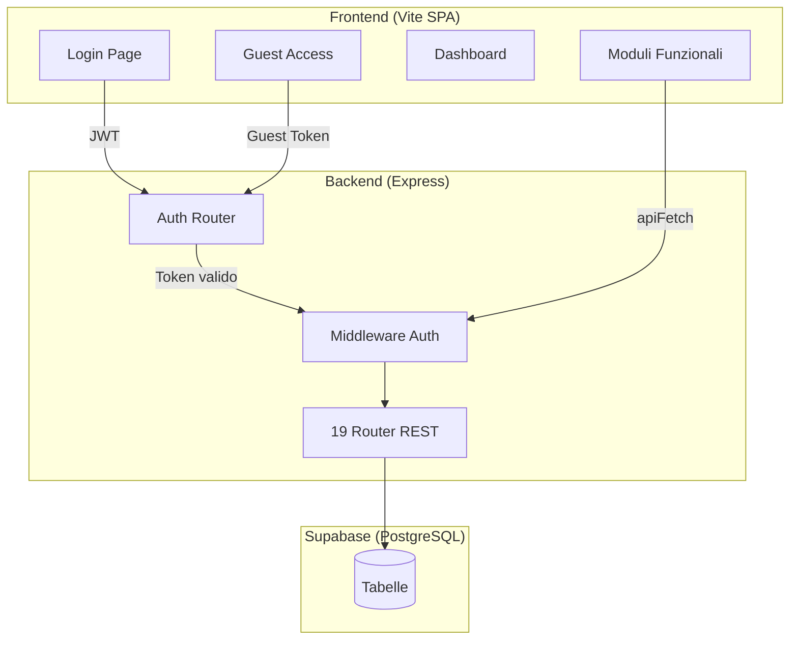

---

## 🔐 Flusso Autenticazione

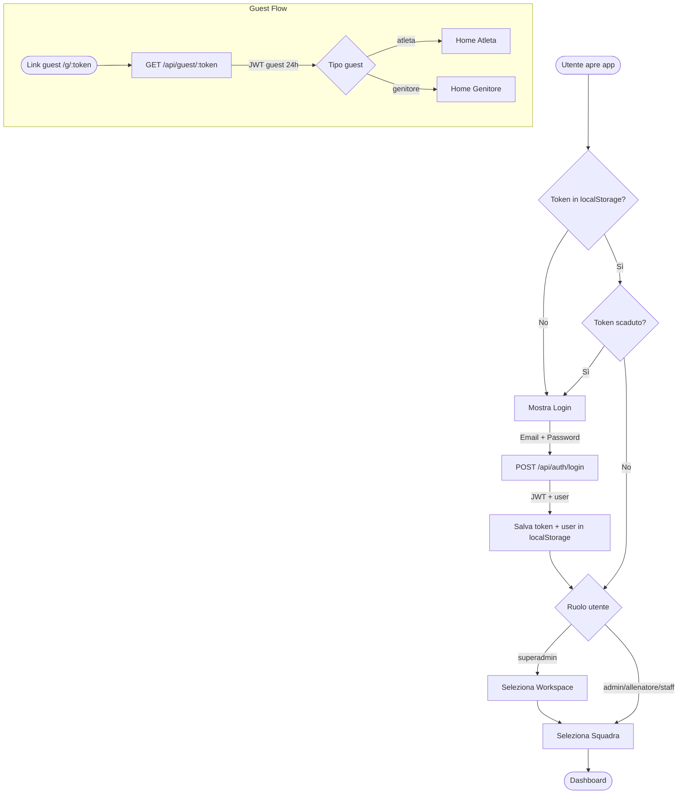

---

## 🏠 Dashboard — Caricamento Dati

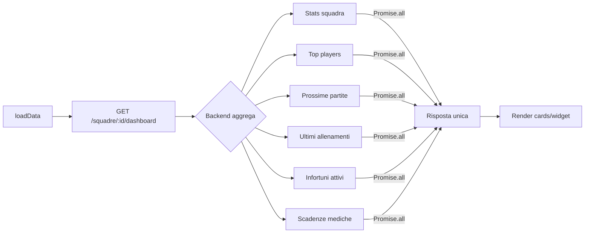

---

## ⚽ Flusso Partita Completo (Lifecycle)

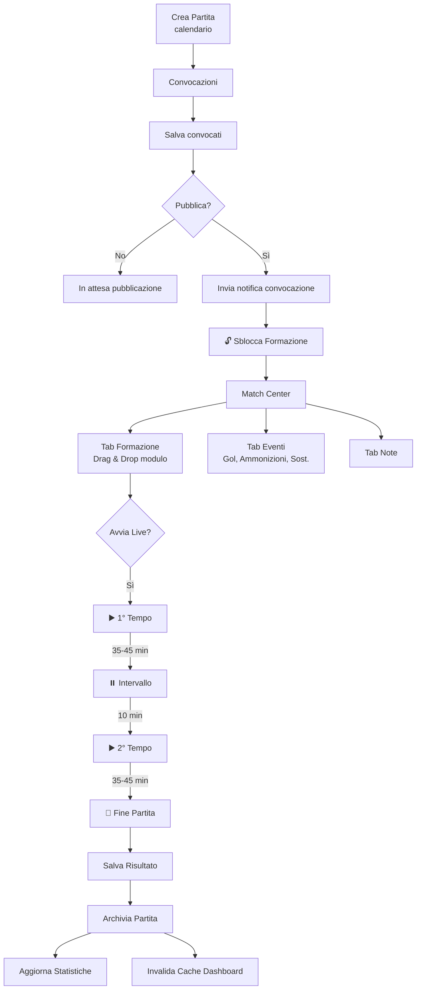

---

## 📋 Flusso Convocazioni → Formazione → Distinta

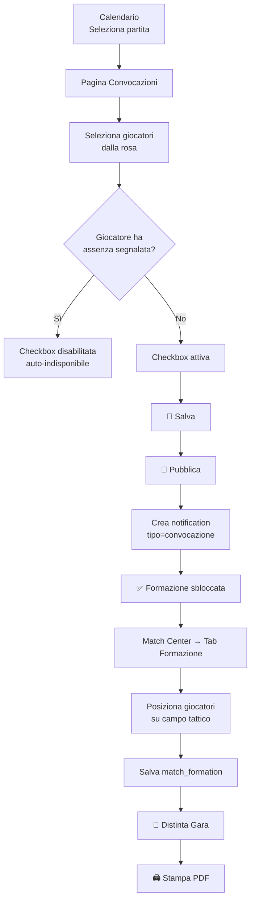

---

## 👥 Gestione Rosa (Roster)

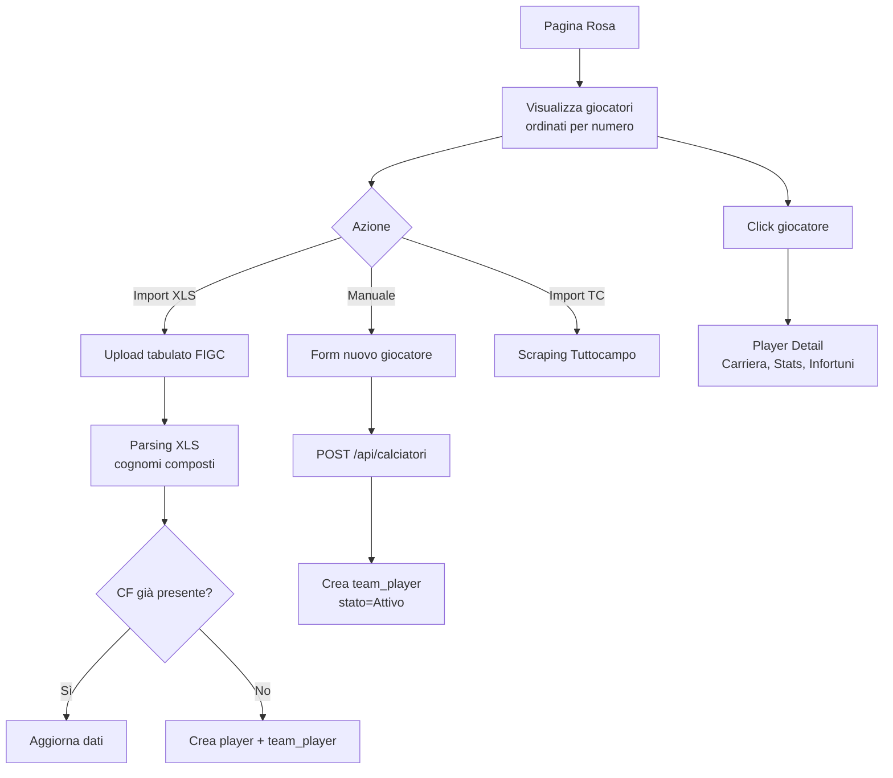

---

## 🏋️ Flusso Allenamenti

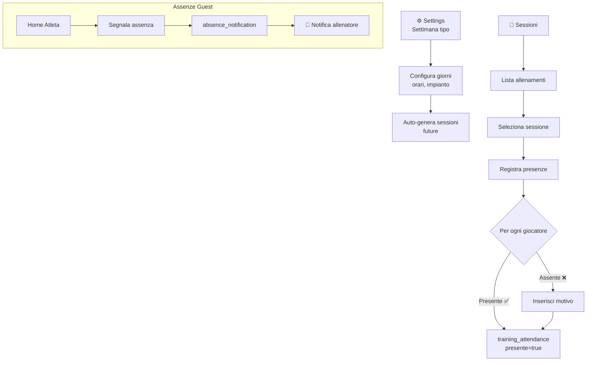

---

## 📊 Flusso Statistiche e Report

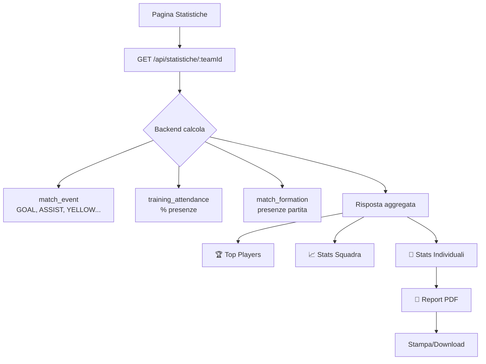

---

## 🔄 Flusso Import (Import Center)

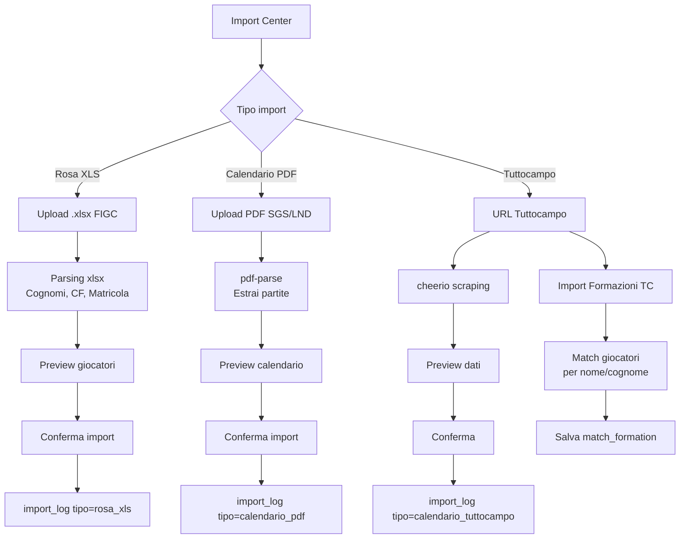

---

## 💰 Flusso Quote Economiche (Fees)

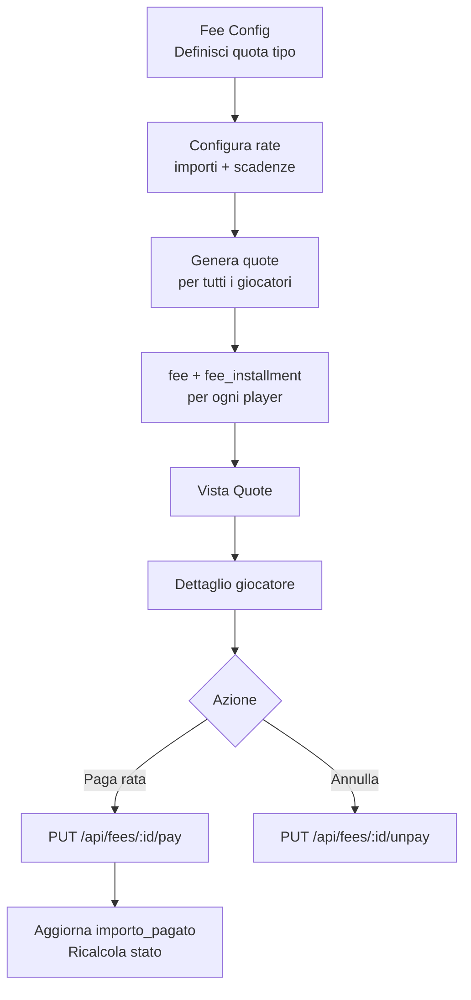

---

## 👔 Flusso Staff e Permessi

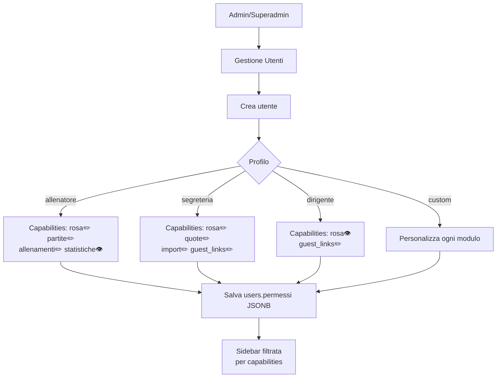

---

## 🔔 Flusso Notifiche

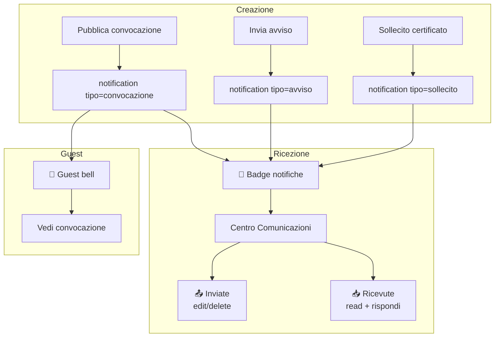

---

## 🗓️ Flusso Calendario

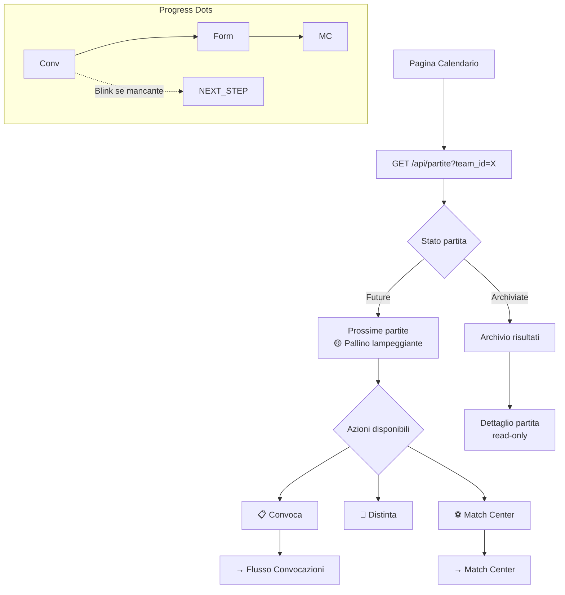

---

## 🏢 Flusso Workspace / Stagioni / Categorie

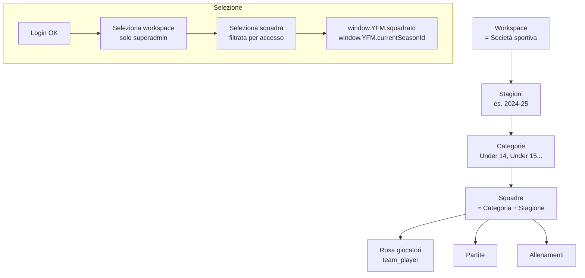

---

## 🖨️ Flusso Stampe (Print Center)

```mermaid
flowchart LR
    PRINT[Print Center] --> P1[📋 Convocazione PDF]
    PRINT --> P2[📄 Distinta Gara]
    PRINT --> P3[⚽ Formazione]
    PRINT --> P4[📊 Report Partita]
    PRINT --> P5[📅 Presenze]
    PRINT --> P6[👥 Rosa]
    PRINT --> P7[🏥 Scadenze Mediche]
    PRINT --> P8[📝 Tesseramento]

    P1 & P2 & P3 & P4 & P5 & P6 & P7 & P8 --> RENDER_PDF[Render HTML<br/>→ window.print()]
```

---

## 🔑 Mappa Permessi → Pagine

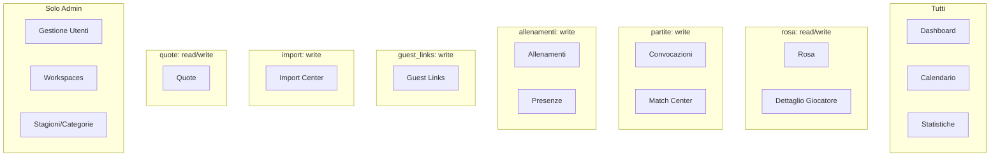

---

## Legenda

| Simbolo | Significato |
|---------|-------------|
| `([...])` | Inizio/Fine |
| `[...]` | Azione/Processo |
| `{...}` | Decisione |
| `-->` | Flusso diretto |
| `-.->` | Flusso condizionale |
| `subgraph` | Raggruppamento logico |

---

> 📌 **Come visualizzare**: Apri questo file su GitHub, oppure usa l'estensione VS Code "Markdown Preview Mermaid Support", oppure incolla i blocchi su [mermaid.live](https://mermaid.live).
